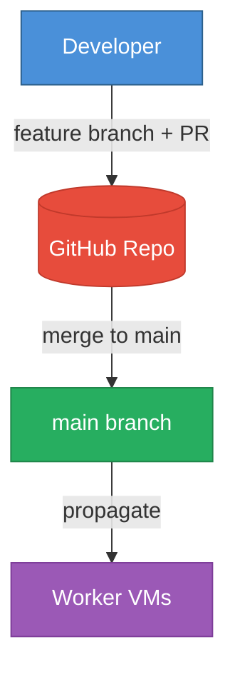

# GitOps — Development Workflow

## Rules

1. **All development happens via feature branches and PRs.** Never push directly to `main`.
2. **No secrets in tracked files.** All credentials go in `.env` (gitignored). If you can't `git clone` and run by only changing `.env`, something is hardcoded.
3. **No hardcoded IPs, accounts, or org references.** Everything configurable via env vars or `config/swe_team.yaml`.
4. **Tests must pass before merging.** Run `make test` to verify.

## Environment Variables (all config, no hardcoding)

| Variable | What it configures |
|----------|-------------------|
| `SWE_TEAM_ID` | Team scoping for tickets |
| `SWE_GITHUB_ACCOUNT` | Dedicated GitHub bot account |
| `SWE_GITHUB_REPO` | Target repository (owner/repo) |
| `GH_TOKEN` | GitHub authentication |
| `SWE_REMOTE_NODES` | JSON array of SSH worker nodes for remote log collection |
| `SWE_SSH_CONFIG` | Path to scoped SSH config (default: `config/ssh_workers.conf`) |
| `SUPABASE_URL` / `SUPABASE_ANON_KEY` | Ticket store backend |
| `TELEGRAM_BOT_TOKEN` / `TELEGRAM_CHAT_ID` | Notifications |

## Architecture Diagram

## Code Propagation

When code is merged to `main`, it can propagate to worker nodes:

- **Webhook-based**: Configure a GitHub push webhook to trigger propagation automatically
- **Manual**: Use SSH to pull changes on worker nodes
- **Script**: Use the propagation scripts in `scripts/ops/` for parallel deployment
