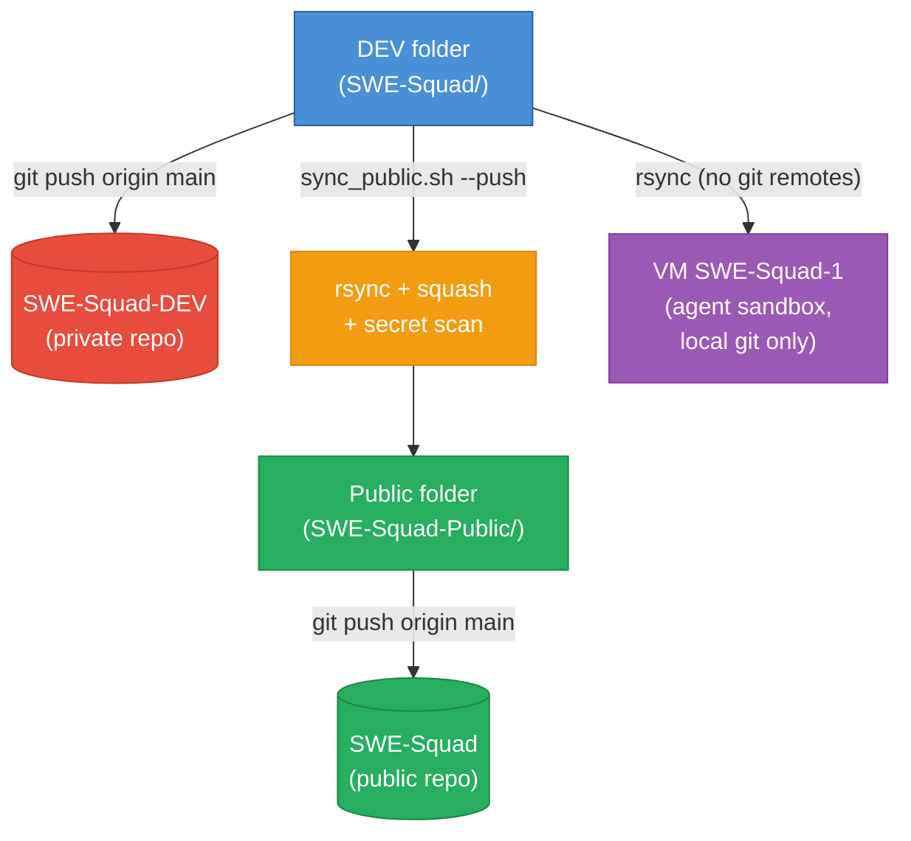
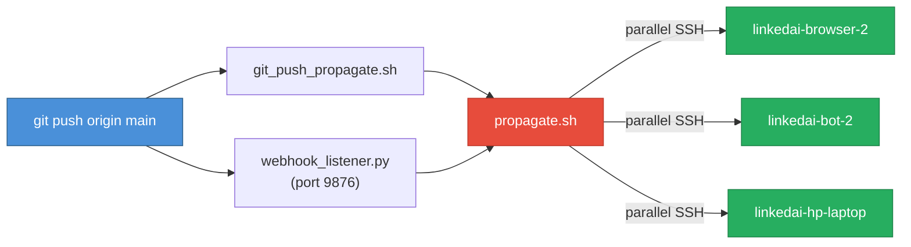

# GitOps — DEV ↔ Public Repo Architecture

## Repo Layout

| Folder | Repo | Visibility | Purpose |
|--------|------|------------|---------|
| `SWE-Squad/` | `ArtemisAI/SWE-Squad-DEV` | Private | All development happens here |
| `SWE-Squad-Public/` | `ArtemisAI/SWE-Squad` | Public | Open-source release, clean commits only |

## Rules

1. **All work happens in the DEV repo.** Never edit the public folder directly.
2. **No secrets in tracked files.** All credentials go in `.env` (gitignored). If you can't `git clone` and run by only changing `.env`, something is hardcoded.
3. **No hardcoded project names, IPs, accounts, or org references.** Everything configurable via env vars or `config/swe_team.yaml`.
4. **Co-Authored-By trailers are fine in DEV commits** — they never reach public.
5. **Never push from DEV folder to public.** Use the sync script.
6. **Never give SWE agents access to ArtemisAI (personal account) or either GitHub repo.** Agents use `ArtemisArchitect` and work on local clones with no git remotes.

## Syncing to Public

```bash
# Preview what will sync
./scripts/ops/sync_public.sh

# Execute (squashes into one clean commit, scans for secrets, pushes)
./scripts/ops/sync_public.sh --push

# With custom commit message
./scripts/ops/sync_public.sh --push -m "v0.2.0 — New feature X"
```

The script:
- Rsyncs tracked files (excludes `.env`, `docs/`, `data/`, `__pycache__/`)
- Scans for real secrets before committing
- Creates one clean commit with no AI attribution
- Pushes to the public repo
- Records the sync point in `.last_public_sync` (gitignored)

## Environment Variables (all config, no hardcoding)

| Variable | What it configures |
|----------|-------------------|
| `SWE_TEAM_ID` | Team scoping for tickets |
| `SWE_GITHUB_ACCOUNT` | Dedicated GitHub bot account |
| `SWE_GITHUB_REPO` | Target repository (owner/repo) |
| `GH_TOKEN` | GitHub authentication |
| `SWE_REMOTE_NODES` | JSON array of SSH worker nodes for remote log collection |
| `SWE_SSH_CONFIG` | Path to scoped SSH config (default: `config/ssh_workers.conf`) |
| `WEBHOOK_PORT` | GitHub webhook listener port (default: `9876`) |
| `WEBHOOK_SECRET` | HMAC secret for webhook signature validation |
| `SUPABASE_URL` / `SUPABASE_ANON_KEY` | Ticket store backend |
| `TELEGRAM_BOT_TOKEN` / `TELEGRAM_CHAT_ID` | Notifications |

## Architecture Diagram



## Instant Code Propagation

When code is pushed to `main`, it propagates to all worker nodes immediately:



- **Local push:** `bash scripts/ops/git_push_propagate.sh origin main` — pushes then propagates.
- **Webhook:** `scripts/ops/webhook_listener.py` listens for GitHub push events (systemd service: `swe-webhook.service`).
- **Manual:** `bash scripts/ops/propagate.sh --project linkedai` — propagate on demand.
- **Dry run:** `bash scripts/ops/propagate.sh --dry-run` — show what would run without executing.
