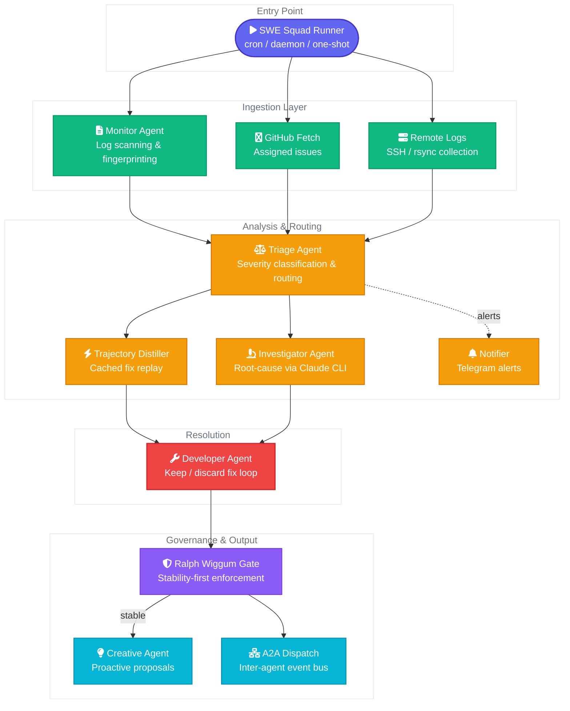
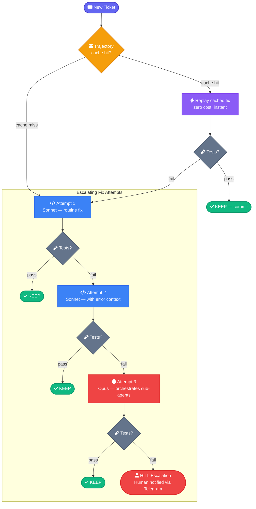
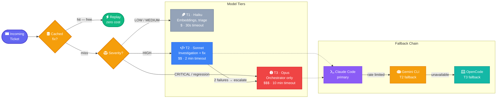
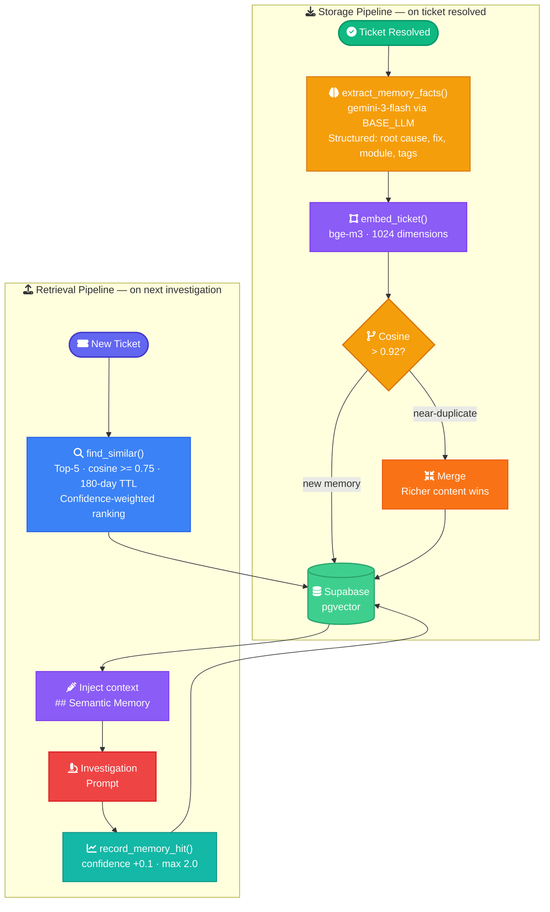
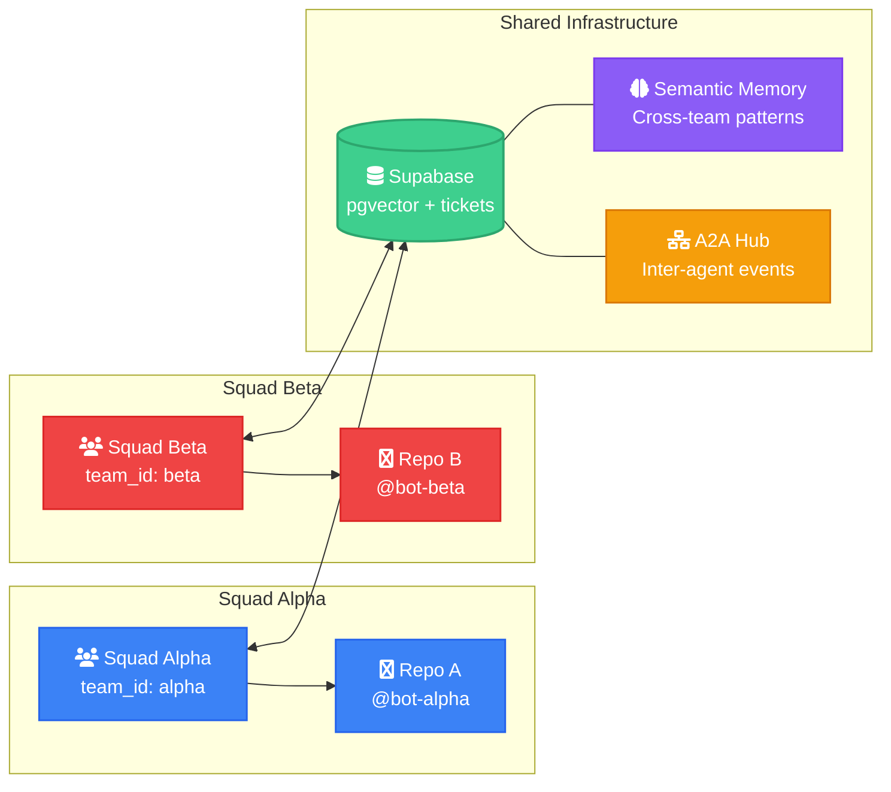

<p align="center">
  
  
  
  
  
</p>

<h1 align="center">SWE Squad</h1>

<p align="center">
  <strong>Autonomous Software Engineering Agents That Fix Bugs While You Sleep</strong>
</p>

<p align="center">
  Self-healing, self-diagnosing development agents that monitor production systems,<br>
  detect errors, investigate root causes, implement fixes, and learn from successes.
</p>

<p align="center">
  Built on <a href="https://docs.anthropic.com/en/docs/claude-code">Claude Code</a> &bull;
  <a href="https://github.com/google/A2A">A2A Protocol</a> &bull;
  <a href="https://supabase.com">Supabase</a>
</p>

---

## Overview

SWE Squad is a team of AI agents that autonomously monitors your production systems, detects issues, and fixes them — with human oversight at every critical decision point.

Unlike single-agent coding tools, SWE Squad operates as a **coordinated team** where each agent has a specialized role, cost-optimized model routing keeps bills low, and a stability gate prevents regressions.

### Key Features

- **Automated Error Detection** — Scans logs for errors with fingerprint-based deduplication
- **Smart Model Routing** — Haiku for cheap tasks, Sonnet for routine fixes, Opus for critical orchestration only
- **Divide-and-Conquer** — Opus orchestrates parallel sub-agents; never implements directly; context window stays clean
- **Multi-Agent Fallback Chain** — Claude Code → exponential backoff → Gemini CLI → Telegram HITL; wheels keep turning even under rate limits
- **Live Model Probing** — tests each BASE_LLM candidate with a real API call before selecting it; auto-heals broken model configs
- **Keep/Discard Fix Loop** — every fix lives on a git branch; tests fail = auto-revert
- **Ralph Wiggum Gate** — stability-first governance: bugs must be fixed before features ship
- **Deterministic Replay** — caches successful fixes by error fingerprint for zero-cost replay
- **Semantic Memory** — pgvector embeddings surface similar past fixes at investigation time; mem0-style fact extraction; confidence-weighted retrieval with TTL
- **Multi-Repo Support** — each ticket carries a `repo` field; agents run in the correct local clone automatically
- **Multi-Team Support** — multiple squads share a Supabase backend without overlap
- **A2A Protocol** — JSON-RPC 2.0 inter-agent communication; hub at `100.110.176.73:18790` (openclaw, gemini, llm_proxy)
- **MCP Servers** — DeepWiki (library docs), Playwright (browser automation), GitHub, Supabase — available in all agent subprocesses
- **CLI Tools** — `swe-cli` for status, tickets, issues, and daily reports from terminal or cron
- **CLI Framework Evaluation** — see `CLI_FRAMEWORK_EVALUATION.md` for framework comparison and recommendation
- **Model Card** — `config/swe_team/model_card.md` documents all 43+ models, agents, routing rules, and cost estimates

---

## Architecture



---

## How the Fix Loop Works



Each attempt runs on a **git branch**. Tests pass = commit. Tests fail = `git reset --hard` (auto-revert). No broken code ever reaches main.

---

## Model Routing

SWE Squad routes to the cheapest model that can handle the job:

| Scenario | Model | Cost | Timeout |
|----------|-------|------|---------|
| Issue scanning, docs | **Haiku** | $ | 30s |
| Routine HIGH bugs | **Sonnet** | $$ | 2 min |
| CRITICAL bugs | **Opus** | $$$ | 10 min |
| After 2 failed Sonnet attempts | **Opus** | $$$ | 10 min |
| Deterministic replay (cached) | **None** | Free | < 1s |



---

## Quick Start

### 1. Clone & install

```bash
git clone https://github.com/ArtemisAI/SWE-Squad.git
cd SWE-Squad
pip install python-dotenv pyyaml
```

### 2. Configure

```bash
cp .env.example .env
```

Edit `.env` with your credentials:

```bash
# Required
SWE_TEAM_ENABLED=true
SWE_TEAM_ID=my-squad
SWE_GITHUB_ACCOUNT=my-bot-account    # Dedicated GitHub account for the squad
SWE_GITHUB_REPO=owner/repo           # Repository to monitor
GH_TOKEN=ghp_...                     # GitHub PAT with repo scope

# Optional
TELEGRAM_BOT_TOKEN=...               # For alerts
TELEGRAM_CHAT_ID=...                 # For alerts
SUPABASE_URL=...                     # For shared ticket store
SUPABASE_ANON_KEY=...                # For shared ticket store
```

### 3. Run

```bash
# Bootstrap — acknowledge existing errors on first run
python scripts/ops/swe_team_runner.py --bootstrap -v

# Single scan cycle
python scripts/ops/swe_team_runner.py -v

# Daemon mode (continuous 30-minute cycles)
python scripts/ops/swe_team_runner.py --daemon -v

# Daily summary via Telegram
python scripts/ops/swe_team_runner.py --summary
```

### 4. Test

```bash
python -m pytest tests/unit/test_swe_team.py -v
```

---

## Configuration

### Environment Variables

| Variable | Required | Description |
|----------|----------|-------------|
| `SWE_TEAM_ENABLED` | Yes | Kill switch (`true`/`false`) |
| `SWE_TEAM_ID` | Yes | Unique team identifier for ticket scoping |
| `SWE_GITHUB_ACCOUNT` | Yes | Dedicated GitHub bot account for issue assignment |
| `SWE_GITHUB_REPO` | Yes | Target repository (`owner/repo`) |
| `GH_TOKEN` | Yes | GitHub PAT with `repo` scope |
| `SWE_TEAM_CONFIG` | No | Path to `swe_team.yaml` (default: `config/swe_team.yaml`) |
| `TELEGRAM_BOT_TOKEN` | No | Telegram bot token for alerts |
| `TELEGRAM_CHAT_ID` | No | Telegram chat ID for alerts |
| `SUPABASE_URL` | No | Enables Supabase ticket store |
| `SUPABASE_ANON_KEY` | No | Supabase authentication key |
| `BASE_LLM_API_URL` | No | External OpenAI-compatible proxy for embeddings and fact extraction |
| `BASE_LLM_API_KEY` | No | API key for BASE_LLM proxy |
| `EMBEDDING_MODEL` | No | Embedding model (default: `bge-m3`, 1024-dim) |
| `EMBEDDING_API_URL` | No | Embeddings endpoint (defaults to `BASE_LLM_API_URL`) |
| `EMBEDDING_API_KEY` | No | Embeddings key (defaults to `BASE_LLM_API_KEY`) |
| `EXTRACTION_MODEL` | No | Fact-extraction model via BASE_LLM (default: `gemini-3-flash`) |
| `SWE_MODEL_T1` | No | Override T1 model tier (default: `haiku`) |
| `SWE_MODEL_T2` | No | Override T2 model tier (default: `sonnet`) |
| `SWE_MODEL_T3` | No | Override T3 model tier (default: `opus`) |
| `SWE_REMOTE_NODES` | No | JSON array of SSH worker nodes for log collection |

### YAML Config (`config/swe_team.yaml`)

Controls governance thresholds, monitoring patterns, and agent definitions. See the included config file for full documentation.

---

## Ticket Store

Two backends are available — the runner auto-selects based on environment variables:

| Backend | When | Pros | Setup |
|---------|------|------|-------|
| **JSON** | `SUPABASE_URL` not set | Zero deps, single file, works anywhere | Nothing — it's the default |
| **Supabase** | `SUPABASE_URL` + `SUPABASE_ANON_KEY` set | Multi-agent, queryable, audit trail, real-time | Run `scripts/ops/supabase_schema.sql` |

### Supabase Schema

```bash
psql $DATABASE_URL -f scripts/ops/supabase_schema.sql
```

Creates:
- `swe_tickets` — main work queue with team scoping, embedding column, memory lifecycle fields
- `swe_ticket_events` — immutable audit trail
- Views: `v_backlog`, `v_queue_critical`, `v_queue_by_agent`, `v_stability`
- RPCs: `match_similar_tickets`, `increment_memory_confidence`

---

## Semantic Memory

SWE Squad learns from resolved tickets. When an investigator starts on a new ticket, it searches for the most similar resolved tickets and injects them as context — reducing time to diagnosis and preventing repeated investigations of the same class of bug.

### How it works



1. **Fact extraction** — when a ticket is resolved, `gemini-3-flash` (via BASE_LLM proxy) distils the investigation report into a compact structured fact: root cause, fix applied, affected module, and error/fix tags
2. **Embedding** — the structured fact is embedded with `bge-m3` (1024-dim) and stored in Supabase pgvector
3. **Deduplication** — before storing, a 0.92-threshold cosine check prevents near-duplicate memories; richer content wins on merge
4. **Retrieval** — at investigation time, the top-5 most similar memories (>=0.75 cosine, <=180 days old) are injected into the investigation prompt
5. **Confidence** — each time a memory is used, its `memory_confidence` score increases (+0.1, max 2.0); confidence-weighted ranking surfaces proven memories over stale ones

### Requirements

- Supabase with pgvector extension (`CREATE EXTENSION IF NOT EXISTS vector`)
- BASE_LLM proxy with `bge-m3` for embeddings and `gemini-3-flash` for extraction
- Run `scripts/ops/supabase_schema.sql` to create the schema

---

## Multi-Team Support

Multiple SWE Squads can operate independently on the same infrastructure:



Each squad:
- Has its own `team_id` scoping all tickets
- Uses a dedicated GitHub bot account
- Only picks up issues assigned to its account
- Shares the Supabase backend without overlap

---

## Components

| File | Purpose |
|------|---------|
| `src/swe_team/monitor_agent.py` | Log scanning, error detection, fingerprint dedup |
| `src/swe_team/triage_agent.py` | Severity routing, specialist assignment |
| `src/swe_team/investigator.py` | Claude Code CLI diagnosis; semantic memory context injection; model routing |
| `src/swe_team/developer.py` | Keep/discard fix loop with git branches; preflight validation |
| `src/swe_team/ralph_wiggum.py` | Stability gate — bugs before features |
| `src/swe_team/governance.py` | Deployment governor, complexity limits |
| `src/swe_team/creative_agent.py` | Proactive improvement proposals (only when stable) |
| `src/swe_team/distiller.py` | Trajectory distillation — cache successful fixes for zero-cost replay |
| `src/swe_team/embeddings.py` | bge-m3 embeddings + mem0-style fact extraction via BASE_LLM proxy |
| `src/swe_team/supabase_store.py` | Supabase ticket store; semantic dedup; memory confidence lifecycle |
| `src/swe_team/ticket_store.py` | JSON ticket store — zero-dependency default |
| `src/swe_team/telegram.py` | Standalone Telegram Bot API client (stdlib only) |
| `src/swe_team/notifier.py` | Telegram alerts, HITL escalation, daily summaries |
| `src/swe_team/preflight.py` | PreflightCheck — validates environment before agent commits |
| `src/swe_team/github_integration.py` | GitHub issue creation and commenting (repo-aware) |
| `src/swe_team/remote_logs.py` | SSH/rsync log collection from workers |
| `src/a2a/adapters/swe_team.py` | A2A protocol adapter for inter-agent events |
| `scripts/ops/swe_team_runner.py` | Main entry point — cron, daemon, bootstrap, report modes |
| `scripts/ops/swe_cli.py` | CLI tool — status, tickets, issues, repos, summary, report |
| `scripts/ops/supabase_schema.sql` | Full Supabase DDL: tables, indexes, RLS, pgvector RPCs |
| `config/swe_team/programs/` | Prompt programs: `investigate.md`, `fix.md`, `orchestrate.md` |
| `crontab.example` | Recommended cron schedules for continuous monitoring and reports |

---

## Requirements

- **Python 3.10+**
- **[Claude Code CLI](https://docs.anthropic.com/en/docs/claude-code)** — the AI backbone
- **[GitHub CLI](https://cli.github.com/)** (`gh`) — authenticated for issue management
- **SSH access** to worker machines (optional, for remote log collection)
- **Telegram bot** (optional, for notifications)
- **Supabase project** (optional, for shared multi-team ticket store)

---

## Contributing

We welcome contributions! Please see [CONTRIBUTING.md](CONTRIBUTING.md) for guidelines.

### Development Setup

```bash
git clone https://github.com/ArtemisAI/SWE-Squad.git
cd SWE-Squad
pip install python-dotenv pyyaml pytest
cp .env.example .env
# Edit .env with your test credentials
python -m pytest tests/unit/test_swe_team.py -v
```

### Areas We'd Love Help With

- Additional ticket store backends (Redis, SQLite, PostgreSQL direct)
- CI/CD pipeline integration (GitHub Actions, GitLab CI)
- Web dashboard for ticket monitoring
- Additional notification channels (Slack, Discord, email)
- Agent prompt optimization and benchmarking
- Documentation and tutorials

---

## Roadmap

- [x] Core agent loop (monitor → triage → investigate → fix)
- [x] Ralph Wiggum stability gate
- [x] Trajectory distillation (cached fixes, zero-cost replay)
- [x] Supabase ticket store with multi-team support and audit trail
- [x] A2A protocol adapter
- [x] Semantic memory — pgvector embeddings + mem0-style extraction + confidence lifecycle
- [x] Monitor self-scan recursion prevention
- [x] Preflight validation gate
- [x] Closed-loop regression detection and re-investigation
- [x] CLI tools (`swe-cli`) for status, tickets, and reports
- [x] Cron integration
- [ ] Web dashboard for ticket monitoring
- [ ] GitHub Actions integration
- [ ] Slack/Discord notifications
- [ ] Custom agent plugin system
- [ ] Metrics and observability (Prometheus/Grafana)

---

## Support & Sponsoring

If SWE Squad is useful to your team, consider supporting the project:

<p align="center">
  <a href="https://github.com/sponsors/ArtemisAI">
    
  </a>
</p>

- **Star** this repo to help others discover it
- **Report issues** — bug reports and feature requests are valuable contributions
- **Share** with your team — the more users, the better the project gets
- **Contribute** — PRs are welcome, see [CONTRIBUTING.md](CONTRIBUTING.md)

For enterprise support or custom deployments, reach out via [GitHub Discussions](https://github.com/ArtemisAI/SWE-Squad/discussions).

---

## License

[MIT](LICENSE) — use it, fork it, build on it.
