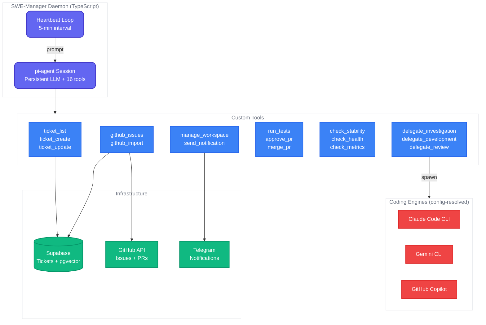
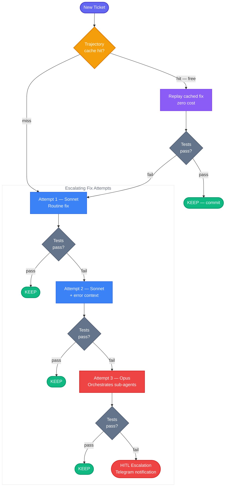
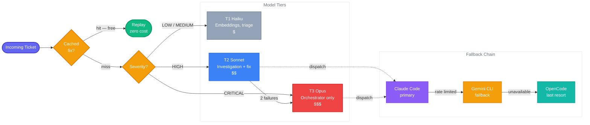
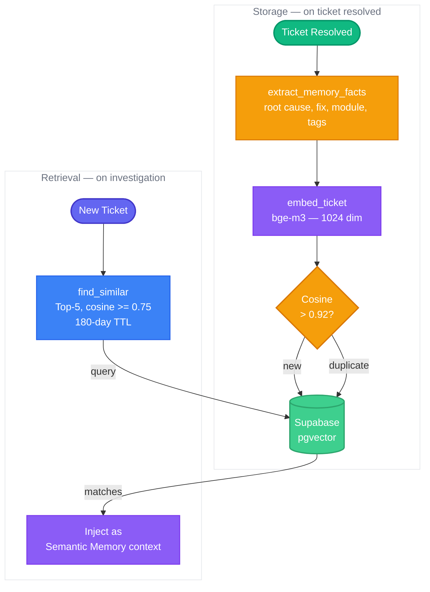

<p align="center">
  
  
  
  
  
  
  
</p>

<h1 align="center">SWE Squad</h1>

<p align="center">
  <strong>Autonomous Software Engineering Agents That Fix Bugs While You Sleep</strong>
</p>

<p align="center">
  An always-on AI engineering manager backed by a persistent LLM session with 16 custom tools.<br>
  Scans GitHub issues, investigates root causes, delegates fixes, reviews PRs, and enforces safety gates — autonomously.
</p>

<p align="center">
  Built on <a href="https://github.com/nichochar/pi-coding-agent">pi-agent SDK</a> &bull;
  <a href="https://docs.anthropic.com/en/docs/claude-code">Claude Code</a> &bull;
  <a href="https://supabase.com">Supabase</a> &bull;
  <a href="https://github.com/google/A2A">A2A Protocol</a>
</p>

---

## Overview

SWE Squad is an **always-on AI engineering manager** that runs as a persistent daemon. It:

1. **Imports** GitHub issues as structured tickets into a Supabase store
2. **Triages** by severity — the LLM decides priority, not hardcoded rules
3. **Investigates** root causes by delegating to any configured coding engine
4. **Develops** fixes on feature branches with automated test verification
5. **Reviews** PRs with structured feedback (security, correctness, style)
6. **Merges** approved changes and monitors for regressions
7. **Notifies** via Telegram on critical events, PR creation, and failures

The system is built on two codebases:

| Layer | Language | Purpose |
|-------|----------|---------|
| **Control Plane** | TypeScript | Persistent pi-agent daemon with 16 custom tools — the decision-making brain |
| **Agent Library** | Python | Specialized agents (monitor, triage, investigate, develop), ticket store, embeddings |

### Key Capabilities

- **16 Custom Tools** — ticket CRUD, GitHub import, investigation/development/review delegation, PR management, workspace provisioning, safety gates, health monitoring, notifications
- **Engine-Agnostic Delegation** — swap coding engines (Claude CLI, Gemini CLI, Copilot, OpenCode) via config
- **Provider-Agnostic Architecture** — every external service is a swappable plugin behind an interface
- **Persistent Sessions** — JSONL-backed session state survives daemon restarts
- **Safety Gates** — circuit breaker, stability gate, outcome tracker, budget enforcement
- **Semantic Memory** — pgvector embeddings surface similar past fixes at investigation time
- **Multi-Team Support** — multiple squads share Supabase without overlap
- **React WebUI** — management dashboard with Kanban boards, pipeline editor, team controls

---

## Architecture

The V2 architecture centers on a **single persistent LLM session** (via `@mariozechner/pi-coding-agent`) that decides what to do based on its persona and tool results. No hardcoded phases.



### Ticket Pipeline

The daemon flushes right-to-left, completing nearest-done work first:

```
open → investigating → investigation_complete → in_development → in_review → testing → resolved
```

Each heartbeat, the LLM picks the highest-priority ticket closest to completion and advances it one step.

---

## How the Fix Loop Works



Each attempt runs on a **git branch**. Tests pass = commit + PR. Tests fail = `git reset --hard` (auto-revert). No broken code ever reaches main.

---

## Quick Start

### Prerequisites

- **Node.js 20+** and **pnpm** (for the TypeScript control plane)
- **Python 3.10+** (for the agent library and tests)
- **[Claude Code CLI](https://docs.anthropic.com/en/docs/claude-code)** (coding engine)
- **[GitHub CLI](https://cli.github.com/)** (`gh`) authenticated

### 1. Install

```bash
git clone https://github.com/ArtemisAI/SWE-Squad.git
cd SWE-Squad

# TypeScript control plane
cd control-plane && pnpm install && cd ..

# Python agent library
pip install python-dotenv pyyaml
```

### 2. Configure

```bash
cp .env.example .env
# Edit .env with your credentials (see Configuration section)
```

### 3. Run the Daemon

```bash
# Single heartbeat (test your setup)
npx tsx control-plane/src/main.ts --verbose

# Daemon mode (continuous 5-minute heartbeats)
npx tsx control-plane/src/main.ts --daemon --verbose

# Fresh session (discards prior session state)
npx tsx control-plane/src/main.ts --daemon --fresh --verbose

# Dry run (validates config and tool registration, no LLM calls)
npx tsx control-plane/src/main.ts --dry-run
```

### 4. Run Tests

```bash
# Python tests (5900+ tests)
python3 -m pytest tests/ -v --tb=short

# TypeScript tests (900+ tests)
cd control-plane && pnpm test

# TypeScript type checking
cd control-plane && pnpm typecheck
```

---

## The 16 Custom Tools

The daemon's LLM session has access to these tools, registered via `defineTool()` from pi-agent:

| Tool | Purpose |
|------|---------|
| `ticket_list` | Query tickets by status, severity, repo, or pipeline view |
| `ticket_create` | Create a new ticket with fingerprint-based deduplication |
| `ticket_update` | Update ticket status, notes, assignee; enforces resolution audit |
| `github_issues` | List open GitHub issues from configured repositories |
| `github_import` | Import GitHub issues as tickets with dedup (fingerprint: `gh-issue-{repo}-{number}`) |
| `delegate_investigation` | Claim ticket, resolve engine from config, spawn investigation, store report |
| `delegate_development` | Claim ticket, provision workspace, spawn development, create PR |
| `delegate_review` | Spawn code review on a PR with structured feedback |
| `run_tests` | Execute test suite in a workspace and report results |
| `approve_pr` | Approve a pull request via GitHub API |
| `merge_pr` | Merge an approved PR (squash merge) |
| `manage_workspace` | Create/cleanup/list git worktrees for isolated development |
| `check_stability` | Evaluate safety gates: circuit breaker + open criticals + test failures |
| `check_health` | Aggregate health snapshot: Supabase, engines, circuit breaker, uptime |
| `check_metrics` | Pipeline metrics: throughput, cycle time, failure rates |
| `send_notification` | Send alerts via configured provider (Telegram, Slack, webhook) |

---

## Configuration

### Environment Variables

Copy `.env.example` to `.env` and configure:

| Variable | Required | Description |
|----------|----------|-------------|
| `SWE_TEAM_ENABLED` | Yes | Kill switch (`true`/`false`) |
| `SWE_TEAM_ID` | Yes | Unique team identifier for ticket scoping |
| `SWE_GITHUB_ACCOUNT` | Yes | Dedicated GitHub bot account |
| `GH_TOKEN` | Yes | GitHub PAT with `repo` scope |
| `SUPABASE_URL` | Yes | Supabase PostgREST URL |
| `SUPABASE_ANON_KEY` | Yes | Supabase authentication key |
| `TELEGRAM_BOT_TOKEN` | No | Telegram bot token for notifications |
| `TELEGRAM_CHAT_ID` | No | Telegram chat ID for alerts |
| `BASE_LLM_API_URL` | No | OpenAI-compatible proxy for embeddings |
| `ANTHROPIC_BASE_URL` | No | Proxy URL for Claude CLI (engine delegation) |
| `SWE_DAEMON_MODEL` | No | Override daemon LLM model (default: `claude-sonnet`) |
| `SWE_MODEL_T2` | No | Override delegation model tier (default: `sonnet`) |

See [`.env.example`](.env.example) for the full list.

### YAML Config (`config/swe_team.yaml`)

The YAML config controls:

- **`delegation`** — per-role engine binding (investigator, developer, reviewer)
- **`workspace`** — worktree provisioning settings
- **`daemon`** — heartbeat interval, initial prompt, session lifecycle
- **`cycle`** — max concurrent investigations/developments, severity filters
- **`memory`** — embedding model, similarity thresholds, TTL
- **`notification`** — provider selection (telegram/slack/webhook)
- **`governance`** — stability gate thresholds
- **`githubRepos`** — list of repos to scan for issues

---

## Engine Delegation

The daemon never implements directly. It delegates to configured **coding engines** resolved from config:

```yaml
# config/swe_team.yaml
delegation:
  investigator:
    engine: claude-cli
    model: sonnet
    readOnly: true
    timeout: 1800
  developer:
    engine: claude-cli
    model: sonnet
    timeout: 3600
  reviewer:
    engine: claude-cli
    model: haiku
    readOnly: true
    timeout: 900
```

Supported engines: Claude Code CLI, Gemini CLI, OpenCode, GitHub Copilot. Adding a new engine = new file in `providers/engine/` + config entry.

---

## Model Routing

| Scenario | Model | Cost |
|----------|-------|------|
| Daemon management cycle | **Sonnet** | $$ |
| Investigation (default) | **Sonnet** | $$ |
| Development + PR creation | **Sonnet** | $$ |
| PR review | **Haiku** | $ |
| Embeddings, fact extraction | **bge-m3 / gemini-3-flash** | $ |
| CRITICAL bugs | **Opus** | $$$ |
| Deterministic replay (cached) | **None** | Free |



---

## Semantic Memory

When a ticket is resolved, SWE Squad extracts structured facts and stores embeddings in pgvector. On future investigations, the top-5 most similar memories are injected as context.



---

## Plugin Architecture

Every external service is a swappable plugin behind an interface:

| Component | Interface | Default | Alternatives |
|---|---|---|---|
| Coding agent | `CodingEngine` | Claude Code CLI | Gemini CLI, OpenCode, Copilot |
| Notifications | `NotificationProvider` | Telegram | Slack, webhook, email |
| Issue tracker | `IssueTracker` | GitHub Issues | Jira, Linear, GitLab |
| Embeddings | `EmbeddingProvider` | bge-m3 | OpenAI, sentence-transformers |
| Vector store | `VectorStore` | Supabase pgvector | Qdrant, Weaviate, Chroma |
| Task queue | `TaskQueueProvider` | In-memory (heapq) | Redis, RabbitMQ, SQS |
| Workspace | `WorkspaceProvider` | git-worktree | Docker volume, cloud VM |
| Sandbox | `SandboxProvider` | Local subprocess | Docker, Codespaces |

New provider = new file in `providers/<domain>/` + config entry. Nothing else changes.

---

## Project Structure

```
control-plane/                     # TypeScript V2 control plane
  src/
    main.ts                        # Daemon entry point — pi-agent session + heartbeat
    config/
      schemas.ts                   # Zod schemas for all config sections
      loader.ts                    # YAML + env var config loader
    tools/                         # 16 custom pi-agent tools
      ticket-list.ts               # Query tickets by status/severity/repo
      ticket-create.ts             # Create tickets with fingerprint dedup
      ticket-update.ts             # Update status/notes/assignee
      github-issues.ts             # List GitHub issues
      github-import.ts             # Import issues as tickets
      delegate-investigation.ts    # Spawn investigation via engine
      delegate-development.ts      # Spawn development + PR creation
      delegate-review.ts           # Spawn PR review
      run-tests.ts                 # Execute test suite
      approve-pr.ts                # Approve PR via GitHub API
      merge-pr.ts                  # Merge approved PRs
      manage-workspace.ts          # Git worktree provisioning
      check-stability.ts           # Safety gate evaluation
      check-health.ts              # System health snapshot
      check-metrics.ts             # Pipeline metrics
      send-notification.ts         # Notification dispatch
    providers/                     # Provider implementations
      supabase/                    # Supabase client + ticket store
      notification/                # Telegram, Slack, webhook
      engine/                      # Coding engine registry
      memory/                      # Memory service providers
    safety/                        # Circuit breaker, outcome tracker
    services/                      # Memory service, workspace manager
    shared/                        # Engine resolver, prompt builder, context
    extensions/                    # Tool guard, RBAC, cost tracking
  tests/                           # 900+ vitest tests (unit + integration)

src/swe_team/                      # Python agent library
  monitor_agent.py                 # Log scanning, error detection
  triage_agent.py                  # Severity routing
  investigator.py                  # Root-cause analysis via Claude CLI
  developer.py                     # Keep/discard fix loop
  ralph_wiggum.py                  # Stability gate
  supabase_store.py                # Supabase ticket store
  embeddings.py                    # bge-m3 embeddings + fact extraction
  guardrails.py                    # Safety gate coordinator
  cost_tracker.py                  # Budget enforcement
  atomic_checkout.py               # Cross-VM task dedup
  ...                              # 30+ modules total

src/a2a/                           # A2A inter-agent protocol
  server.py, client.py, dispatch.py

ui/                                # React + Vite management dashboard

scripts/ops/                       # Operational scripts
  swe_team_runner.py               # Legacy Python runner (cron/daemon)
  swe_cli.py                       # CLI tool (status, tickets, reports)
  propagate.sh                     # Code propagation to worker nodes

config/
  swe_team.yaml                    # Runtime configuration
  swe_team/programs/               # Prompt templates (investigate.md, fix.md)

.pi/
  skills/swe-manager/SKILL.md      # LLM persona definition
  extensions/                      # pi-agent extension stubs

tests/                             # 5900+ pytest tests
```

---

## Multi-Team Deployment

SWE Squad supports multiple teams sharing infrastructure:

| Team | VM | Role | Engine |
|------|-----|------|--------|
| **alpha** | `primary` | Senior: QA, merge authority, critical fixes | Claude CLI (direct) |
| **beta** | `worker-1` | Development: bulk features, bug fixes | Claude CLI (proxy) |
| **gamma** | `worker-2` | Economy: investigation, triage | Claude CLI (proxy) |

Each team has its own `team_id` scoping all tickets, a dedicated GitHub bot account, and isolated VM.

---

## Safety

- **Circuit Breaker** — trips at 80% failure rate, pauses daemon for 30 minutes
- **Stability Gate** — blocks new work when critical tickets are open or tests are failing
- **Outcome Tracker** — max 3 investigation/development attempts per ticket before HITL escalation
- **Budget Enforcement** — per-agent cost tracking with configurable hard-stops
- **RBAC** — role-based access control on tool invocations (bypass mode by default)
- **Bot Containment** — each bot account is confined to its designated VM

---

## WebUI

The React management dashboard provides:

- **Dashboard** — real-time ticket metrics, PR pipeline, severity donut, cost trends
- **Tickets** — Kanban board with drag-and-drop, search/filter, detail views
- **Teams** — live status indicators, VM connectivity checks, start/stop controls
- **Engines** — coding engine management with health checks and BYOK support
- **Pipeline Editor** — visual workflow editor built on React Flow
- **Settings** — governance thresholds, cycle config, memory settings

```bash
cd ui && npm install && npm run dev
# Opens at http://localhost:5173, proxies API to :8888
```

---

## Requirements

- **Node.js 20+** + **pnpm** — TypeScript control plane
- **Python 3.10+** — agent library and tests
- **[Claude Code CLI](https://docs.anthropic.com/en/docs/claude-code)** — coding engine
- **[GitHub CLI](https://cli.github.com/)** (`gh`) — authenticated for issue + PR management
- **Supabase** — ticket store + semantic memory (pgvector)
- **Telegram bot** (optional) — notifications
- **SSH access** to worker VMs (optional) — remote log collection

---

## Roadmap

- [x] Persistent pi-agent daemon with 16 custom tools
- [x] Engine-agnostic delegation (Claude CLI, Gemini CLI, Copilot, OpenCode)
- [x] Semantic memory with pgvector embeddings + confidence tracking
- [x] Full ticket pipeline: import, investigate, develop, review, merge
- [x] Safety gates: circuit breaker, stability gate, outcome tracker
- [x] React WebUI with Kanban, pipeline editor, team management
- [x] Multi-team deployment (alpha/beta/gamma squads)
- [x] Provider-agnostic plugin architecture
- [ ] Interactive Telegram bot — bidirectional chatbot for remote control ([#1034](https://github.com/ArtemisAI/SWE-Squad/issues/1034))
- [ ] Multi-VM deployment automation
- [ ] npm package: `@swe-squad/control-plane`
- [ ] Public repo sync and launch
- [ ] Slack/Discord notification plugins
- [ ] Metrics and observability (Prometheus/Grafana)
- [ ] Automated benchmarking suite

---

## Contributing

We welcome contributions! Areas where help is most valuable:

- Additional coding engine adapters
- Notification channel plugins (Slack, Discord)
- Interactive Telegram bot ([#1034](https://github.com/ArtemisAI/SWE-Squad/issues/1034))
- New ticket store backends (Redis, SQLite)
- Agent prompt optimization and benchmarking
- Documentation and tutorials

---

## License

[MIT](LICENSE) — use it, fork it, build on it.
