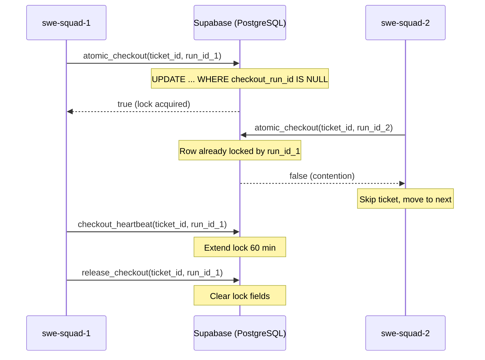

# Atomic Checkout — Preventing Duplicate Work Across VMs

**Issue**: #348
**Priority**: P0
**Status**: Implemented

---

## Problem

When multiple SWE-Squad VMs cycle simultaneously, they can both claim the same ticket — leading to:
- Duplicate investigations (wasted tokens)
- Conflicting branches and PRs
- Race conditions in ticket status updates

### Pre-Implementation Race Window

```
VM-1: read ticket (status=open) ──────────────────── write ticket (status=investigating)
VM-2:          read ticket (status=open) ── write ticket (status=investigating)
                    ↑ RACE WINDOW (~200ms)
```

Both VMs see `status=open`, both start investigating. The Supabase query is not atomic — read and write are separate HTTP requests.

## Solution: Atomic Checkout



### Key Properties

- **Atomic**: Single `UPDATE ... WHERE checkout_run_id IS NULL` — no read-then-write gap
- **Expiring**: Locks auto-expire (default 60 min) — no permanent deadlocks from crashed VMs
- **Heartbeat**: Long investigations extend the lock periodically
- **Fail-closed**: If the RPC fails, checkout is denied (safe default)
- **Observable**: Contention rate, lock duration, expired locks all tracked in metrics

## Architecture

```
CheckoutManager (facade)           ← Runner uses this
    │
    ├── SupabaseCheckoutProvider    ← Multi-VM atomic (PostgreSQL RPCs)
    │       └── atomic_checkout()  ← Single UPDATE, server-side
    │       └── release_checkout()
    │       └── checkout_heartbeat()
    │
    └── InMemoryCheckoutProvider   ← Single-process (threading.Lock)
            └── try_checkout()     ← Dict + Lock, no DB needed
```

### Provider Protocol

```python
class CheckoutProvider(Protocol):
    def try_checkout(self, ticket_id: str, team_id: str, lock_minutes: int = 60) -> Optional[UUID]: ...
    def release(self, ticket_id: str, run_id: UUID) -> bool: ...
    def heartbeat(self, ticket_id: str, run_id: UUID, extend_minutes: int = 60) -> bool: ...
    def is_locked(self, ticket_id: str) -> bool: ...
    def get_lock_info(self, ticket_id: str) -> Optional[CheckoutLock]: ...
    def cleanup_expired(self) -> int: ...
    def force_release(self, ticket_id: str) -> bool: ...
    def metrics(self) -> CheckoutMetrics: ...
```

## Database Migration

Apply `scripts/ops/migrations/002_atomic_checkout.sql` to add:
- `checkout_run_id`, `checkout_locked_at`, `checkout_locked_by`, `checkout_expires_at` columns
- `atomic_checkout()`, `release_checkout()`, `checkout_heartbeat()` RPCs
- Partial index on unlocked tickets for fast queries

## Runner Integration

```python
# On daemon startup
checkout.cleanup_expired()

# Before investigating a ticket
run_id = checkout.try_checkout(ticket.id, config.team_id)
if run_id is None:
    continue  # Another VM has it

try:
    # During long work
    checkout.heartbeat(ticket.id, run_id)
    # ... investigate / develop ...
finally:
    checkout.release(ticket.id, run_id)
```

## Metrics & Monitoring

`CheckoutMetrics` exposed via dashboard `/api/checkout-metrics`:

| Metric | Description |
|--------|-------------|
| `total_checkouts` | Total checkout attempts |
| `successful_checkouts` | Locks acquired |
| `failed_checkouts` | Contention (another VM holds lock) |
| `expired_locks` | Locks that timed out (crashed VMs) |
| `contention_rate` | `failed / total` — watch for > 20% |
| `avg_lock_duration_seconds` | Mean investigation time |

## Configuration

```yaml
checkout:
  provider: supabase  # or "memory" for single-VM
  lock_duration_minutes: 60
  heartbeat_interval_minutes: 30
  cleanup_on_startup: true
```

## Post-Implementation Comparison

| Dimension | Before | After |
|-----------|--------|-------|
| Race window | ~200ms (read-write gap) | 0 (atomic UPDATE) |
| Duplicate work | Possible across VMs | Impossible (lock or skip) |
| Crashed VM recovery | Manual intervention | Auto-expiry after timeout |
| Observability | None | Contention rate + metrics |
| Deadlock risk | N/A | None (expiring locks) |
